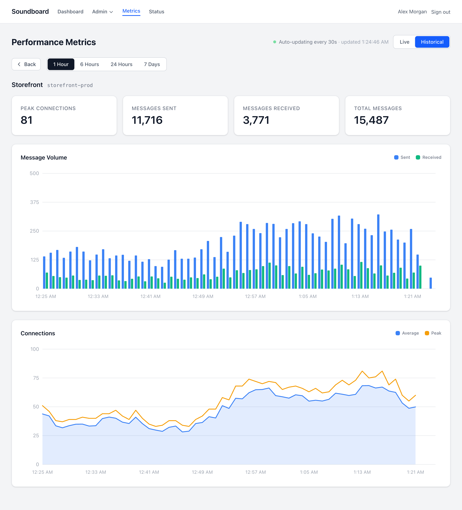
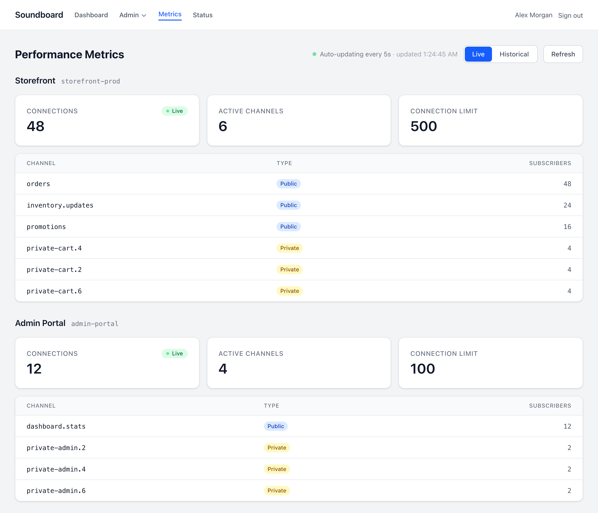
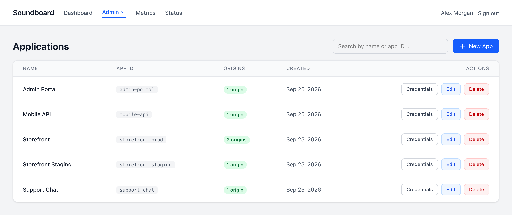

# Soundboard

A multi-app control panel for [Laravel Reverb](https://reverb.laravel.com).

Reverb normally reads its applications from `config/reverb.php`, so adding an app or rotating a secret means a deploy and a server restart. Soundboard stores apps in a database instead, and gives you a dashboard and an API to run one shared Reverb server for any number of applications.

> Soundboard is an independent project. It is not affiliated with or endorsed by Laravel.



## Features

- **Multi-app management**: create apps with their own credentials, allowed origins, and connection and message limits. Changes reach the running Reverb server within seconds, with no restart.
- **Live metrics**: current connections, channels, and subscriber counts for each app.
- **Historical metrics**: connection and message trends over 1 hour to 7 days, recorded with Laravel Pulse.
- **System status**: database, Redis, and Reverb health at a glance, plus a `/api/health` endpoint for load balancers.
- **Role-based access control**: fine-grained permissions for apps, users, roles, tokens, metrics, and status. Users can never grant access they don't hold themselves.
- **API**: manage apps and rotate credentials from scripts and CI with personal access tokens.
- **Secure by default**: app secrets are encrypted at rest, credentials are only visible to users who can edit the app, and login is rate limited.

## Screenshots

**Live metrics**: current connections, channels, and subscriber counts for every app, refreshed every few seconds.



**Applications**: every app on the shared Reverb server, with its origins and credentials.



## Requirements

- PHP 8.3+
- Composer
- Node.js and npm
- SQLite, MySQL 8+, or MariaDB
- Redis (optional, only needed for Reverb horizontal scaling)

## Getting started

```bash
composer create-project jncarter123/soundboard soundboard   # installs, creates .env, and migrates
cd soundboard

npm install && npm run build   # build the dashboard's assets
php artisan db:seed            # creates admin@example.com and prints its password

php artisan serve              # the dashboard
php artisan reverb:start       # the WebSocket server
php artisan pulse:check        # records connection metrics
```

To work on Soundboard itself, clone the repository instead and run `composer setup`, which installs dependencies, creates `.env`, migrates, and builds the assets.

Sign in at `http://localhost:8000` with the printed password and change it straight away.

## Running with Docker

One image runs as three containers from [`compose.yaml`](compose.yaml): the dashboard, the Reverb WebSocket server, and the Pulse metrics recorder.

```bash
curl -fsSLO https://raw.githubusercontent.com/jncarter123/soundboard/main/compose.yaml
curl -fsSL -o docker.env https://raw.githubusercontent.com/jncarter123/soundboard/main/docker.env.example
echo "SOUNDBOARD_IMAGE=jncarter/soundboard:1" > .env   # pull instead of build

docker compose up -d
docker compose exec app php artisan db:seed --force   # creates admin@example.com and prints its password
```

The dashboard is on `127.0.0.1:8000` and Reverb on `127.0.0.1:8080`, both plain HTTP on loopback only, for a reverse proxy in front to terminate TLS. Set `APP_URL` in `docker.env` to the dashboard's public URL, scheme included (`https://soundboard.example.com`), or the browser blocks its assets as mixed content.

- **Back up the volume.** On first start, the dashboard container generates an `APP_KEY` onto the `soundboard-data` volume and says so in its log. It encrypts every stored app secret, so without it clients can't connect. Set `APP_KEY` in `docker.env` instead if you'd rather hold it yourself.
- **Data** lives in SQLite on the same volume. Switch to MySQL or MariaDB in `docker.env`.
- **Upgrades:** `docker compose pull && docker compose up -d`. Migrations run when the dashboard container starts.
- **Reverb is tuned already:** the image includes the libuv event loop and compose raises its file limit to 65,536.

Images are published to Docker Hub as [`jncarter/soundboard`](https://hub.docker.com/r/jncarter/soundboard) for `linux/amd64` and `linux/arm64`, tagged by version (`1.1.0`, `1.1`, `1`), `latest`, and commit SHA. To build from source instead, clone the repository and run `docker compose up -d --build`.

## Connecting an application

Create an app in the dashboard, then point your Laravel app's broadcasting config at Soundboard's Reverb server using the credentials it shows:

```dotenv
BROADCAST_CONNECTION=reverb
REVERB_APP_ID=your-app-id
REVERB_APP_KEY=generated-key
REVERB_APP_SECRET=generated-secret
REVERB_HOST=realtime.example.com
REVERB_PORT=443
REVERB_SCHEME=https
```

Each app must list at least one allowed origin. Reverb matches the browser's host against the list, so enter hostnames such as `app.example.com` or `*.example.com`, or `*` to allow any origin.

## API

Apps can be managed over HTTP with a personal access token created on the **Tokens** page. Requests act as the token's owner and use the same permissions as the dashboard.

```bash
curl -H "Authorization: Bearer $TOKEN" -H "Accept: application/json" https://soundboard.example.com/api/apps
```

| Method | Path | Permission | Notes |
|---|---|---|---|
| `GET` | `/api/apps` | `apps.read` | Paginated; no credentials |
| `POST` | `/api/apps` | `apps.create` | Requires `name`, `app_id`, `allowed_origins`; returns credentials |
| `GET` | `/api/apps/{app_id}` | `apps.read` | |
| `PATCH` | `/api/apps/{app_id}` | `apps.update` | `app_id` can't be changed |
| `DELETE` | `/api/apps/{app_id}` | `apps.delete` | |
| `GET` | `/api/apps/{app_id}/credentials` | `apps.update` | Key and secret |
| `POST` | `/api/apps/{app_id}/credentials` | `apps.update` | Regenerates key and secret |
| `GET` | `/api/health` | none | Public health check |

Requests are limited to 60 per minute per user.

## Configuration

| Variable | Default | Description |
|---|---|---|
| `REVERB_APPS_CACHE_TTL` | `10` | Seconds the running Reverb server keeps apps in memory. Dashboard and API changes, including regenerated credentials, take effect within this window. `0` queries on every lookup. |
| `REVERB_METRICS_HOST` | `127.0.0.1` | Where the dashboard reaches Reverb's HTTP API for live metrics and health checks |
| `REVERB_METRICS_PORT` | `8080` | |
| `REVERB_METRICS_SCHEME` | `http` | |

`APP_KEY` encrypts the stored app secrets. Back it up and never change it on an existing install, or every secret becomes unreadable.

## Production

See the [production tuning guide](docs/reverb-production-tuning.md) for file descriptor limits, the event loop, Supervisor, and Nginx configuration for a server with many long-lived connections.

Two artisan commands help diagnose metrics:

- `php artisan reverb:metrics-diagnose` checks that each app's live connection count can be read.
- `php artisan reverb:metrics-health` reports whether Pulse is still recording Reverb metrics.

## Contributing

Contributions are welcome. See [CONTRIBUTING.md](CONTRIBUTING.md). To report a security issue, follow [SECURITY.md](SECURITY.md) instead of opening a public issue.

## License

Soundboard is open-source software licensed under the [MIT License](LICENSE).
